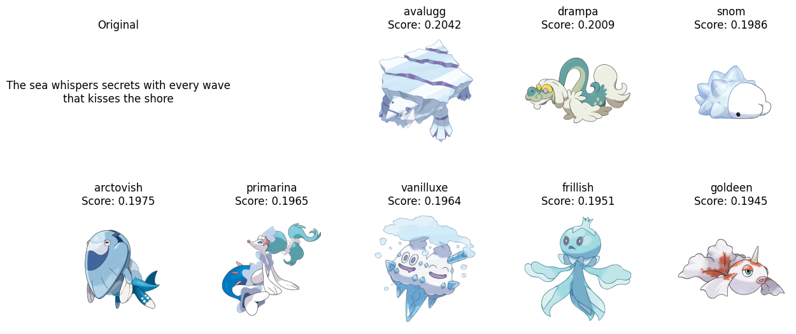
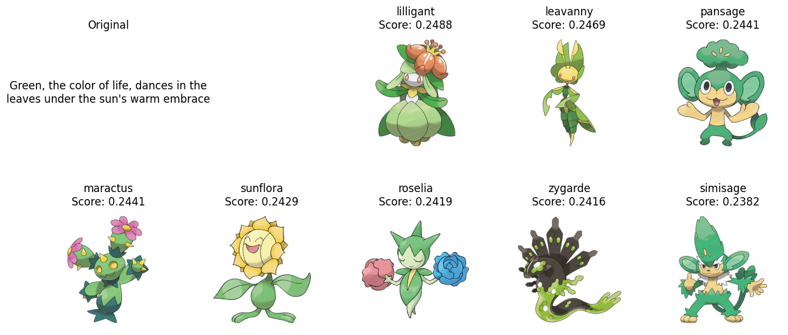
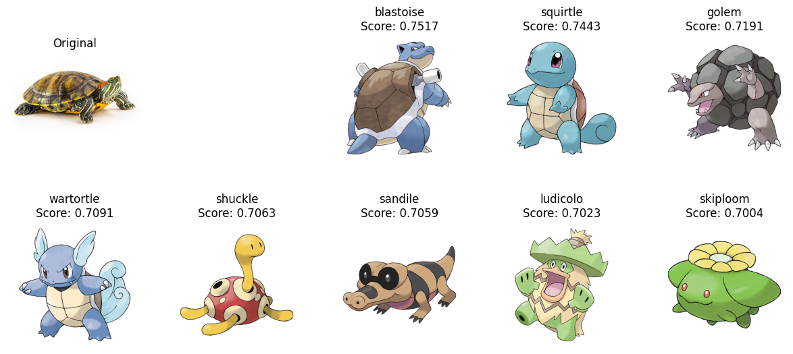
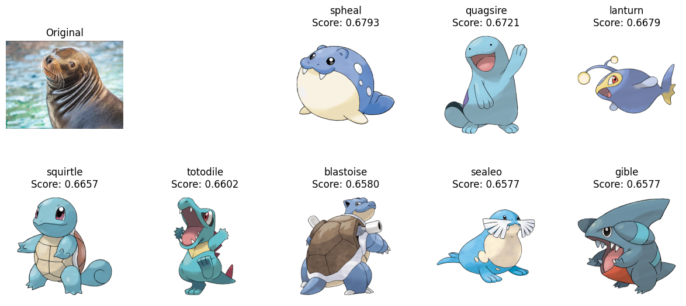
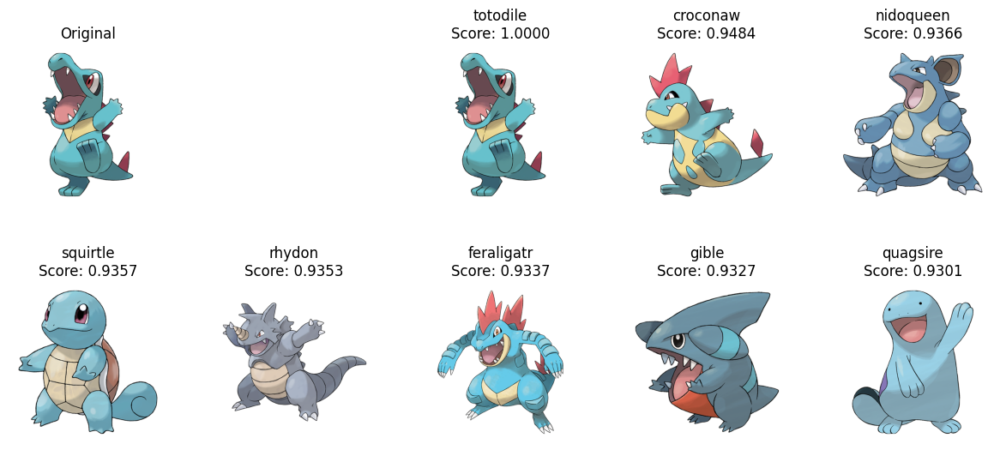
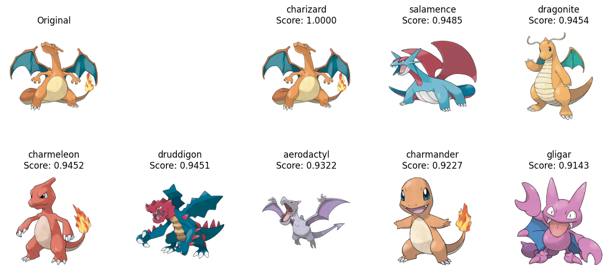

# CLIP Pokedex

Toy example using CLIP for similarity search.

# Usage

## Build the Pokedex index

```bash
python build_pokedex.py
```

## Search your favorite Pokemon

### TEXT

```bash
python search_pokedex.py --text \
    "The sea whispers secrets with every wave that kisses the shore"
```




```bash
python search_pokedex.py --text \
    "Green, the color of life, dances in the leaves under the sun's warm embrace"
```



### IMAGE

```bash
python search_pokedex.py --image \
    "https://assets.petco.com/petco/image/upload/f_auto,q_auto/aquatic-turtle-care-sheet-hero"
```



```bash
python search_pokedex.py --image \
    "https://www.aquariumofpacific.org/images/made_new/images-uploads-chase_side_profile_600_q85.jpg"
```




### POKEMON

```bash
python search_pokedex.py --pokemon \
    totodile
```



```bash
python search_pokedex.py --pokemon \
    charizard
```

